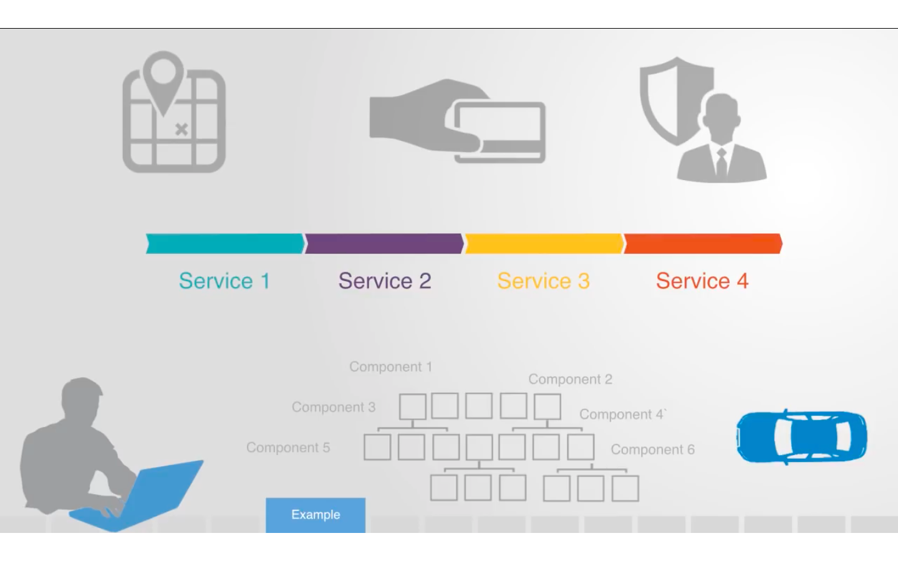

# Service Oriented Architecture

### What is SOA?

According to [Wikipedia](https://en.wikipedia.org/wiki/Service-oriented_architecture),
> Service-oriented architecture (SOA) is a style of software design where services are provided to the other components by application components, through a communication protocol over a network. An SOA service is a discrete unit of functionality that can be accessed remotely and acted upon and updated independently, such as retrieving a credit card statement online. SOA is also intended to be independent of vendors, products and technologies.

This definition is quite overwhelming, so to understand it in an easy and detailed  way let’s break it down into smaller parts and then try to learn them one at a time. But before diving deep into this, it is also important to know *Why there is a need for SOA or any other architectural style* and *Which style is used prior this?*

### Evolution of SOA
As we all know, to accomplish any software engineering task some basic conventions and procedures need to be followed. So, the initial conventions or style that followed in software development is **Single-Tier Architecture**.

In this type of architecture, there is a single machine which acts as a container and all the layers(Presentation layer, Bussiness Logic layer or Database layer) are kept in the same container. Thus it is called **Monolithic Architecture**.

Due to this reason, the above architectural style of software development is:
* *Not Flexible*: It is very difficult to update the code base and make changes in the technology stack used.

* *Less Reliable*: If even a single feature of the system fails the entire system needs to be step down from the production/live.

* *Not Scalable*: The rebuild is mandatory to scale the project as it is programmed hierarchically.

* *No Scope of Continous Development*: building and deployment of features are not possible simultaneously.
 

Thus, the entire software community necessitates a model which can be a perfect fit for complex architectures(where monolithic style fails). So, Here comes SOA as a saviour😎 for the entire development community.

### SOA and its principles

SOA is an approach to distributed system architecture that employs loosely coupled services, standard interfaces and protocols to deliver seamless cross-platform integration. It integrates widely divergent components by providing them with a common interface and a set of protocols for them to communicate through a service bus.

In SOA, the entire application is not built at once. Here, it is broken down into small functional pieces known as services and after building these services the results are combined to reach the desired result.

The main benefit of SOA or any multi-tier architectural style is it provided heterogeneous interoperability.
It simply means that we can create each service into a different technology/tool and then we need to find out the medium of communication among them.

### USE CASE
To make it more clear let’s take an example of a website to book a cab and pay the bill.

* One approach is to create the entire system from the scratch, this process can take a year or more. But even after that there is not any assuring that system will not fail or will not need any updates in future.

* So, the other way is to divide the application/system into subsystems and then choose vendors for the services/sub-systems in the market and integrate them to create your product. Here the only task left is to create an interface for all the services to communicate among them.

In the above figure, we are using Maps by Google, payment gateway by Paypal and login system by Facebook. Our task is to build an interface for the user to interact with all of the three services.

### Disadvantages of SOA

We have seen the effectiveness and efficiency of SOA. But this approach also has some drawbacks associated with it.

* *High overhead*: A validation of input parameters of services is done whenever services interact this decreases performance as it increases load and response time.

* *High investment*: A huge initial investment is required for SOA.

* *Complex service management*: When services interact they exchange messages to tasks. the number of messages may go in millions. It becomes a cumbersome task to handle a large number of messages.

### Conclusion
At last, we can conclude that using the Service Oriented Architecture style of Project development would be beneficial or not depends on the Use case for which we are developing.

# References

[1] [Introduction to SOA by DR Mahesh Potdar](https://www.youtube.com/watch?v=3RNRKLdSODI)

[2] [A Use case Consideration by System Inovation](https://www.youtube.com/watch?v=_dFJOSR-aFs)

[3] [Service Oriented Architecture by Sarthak Garg](https://www.geeksforgeeks.org/service-oriented-architecture/)

[4] [Homogenous Interoperability in SOA by O'Reilly](https://www.oreilly.com/library/view/microservices-vs-service-oriented/9781491975657/ch04.html)

[5] [Wekipedia Article on SOA](https://en.wikipedia.org/wiki/Service-oriented_architecture)

[6] [What Is Service-Oriented Architecture? by Software Development Community](https://medium.com/@SoftwareDevelopmentCommunity/what-is-service-oriented-architecture-fa894d11a7ec)
